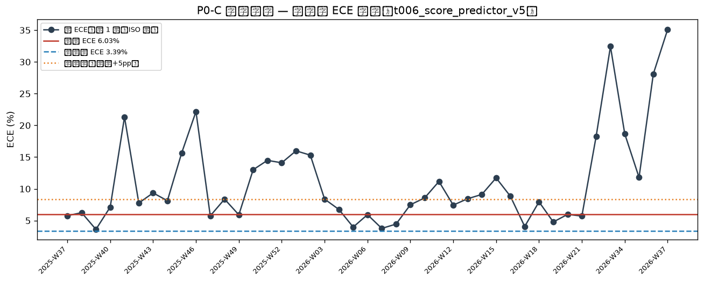
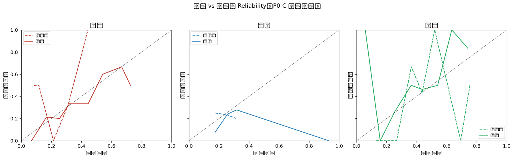

# 概念漂移检测报告（P0-C Concept Drift Gate）

**生成时间**: 2026-09-10 11:49:37
**模型**: `t006_score_predictor_v5`
**窗口模式**: `size-120`（近窗 n=120，参考窗 n=120）
**近窗日期区间**: 2026-05-18 ~ 2026-09-07
**参考窗日期区间**: 2026-05-03 ~ 2026-05-18

## 一、两窗口对比总览

| 窗口 | n | 日期区间 | 总 ECE | LogLoss | Brier | 联赛 Top3 |
|---|---|---|---|---|---|---|
| 近窗 | 120 | 2026-05-18~2026-09-07 | 6.03% (客4.49/平4.38/主9.21) | 1.0338 | 0.6127 | [('', 56), ('西甲', 20), ('英超', 19)] |
| 参考窗 | 120 | 2026-05-03~2026-05-18 | 3.39% (客4.04/平2.35/主3.78) | 1.0756 | 0.6501 | [('西甲', 31), ('法甲', 25), ('意甲', 23)] |

## 二、核心指标

| 指标 | 近窗 | 参考窗 | 判定 |
|---|---|---|---|
| ΔECE（总 ECE 差值） | 6.03% | 3.39% | +2.64pp（阈值 5.00pp）|
| LogLoss 劣化比 | 1.0338 | 1.0756 | 0.96x（阈值 1.30x）|
| Brier 劣化比 | 0.6127 | 0.6501 | 0.94x（阈值 1.30x）|
| PSI（预测概率分布） | — | — | 0.700（观察 0.10 / 强化 0.25）|
| 基础率 P(y) TV | — | — | 0.083（阈值 0.20，仅上下文）|

## 三、检测结果：PASS

**无违规项：近窗条件可靠性相对参考窗未显著漂移。**

**观察项（软信号，不告警）**:

- PSI 0.700 ≥ 0.25：预测概率输入分布显著漂移（佐证强化）

## 四、分桶明细（近窗每类每桶 conf/acc/gap，红标 = 触发局部漂移）

| 类别 | 桶 | n | 近窗预测均值 | 近窗命中率 | 近窗偏差 | 参考窗偏差 |
|---|---|---|---|---|---|---|
| 客胜 | 0.0-0.1 | 6 | 6.77% | 0.00% | +6.77pp | -41.66pp |
| 客胜 | 0.1-0.2 | 14 | 16.79% | 21.43% | -4.64pp | -38.35pp |
| 客胜 | 0.2-0.3 | 25 | 25.35% | 20.00% | +5.35pp | +21.34pp |
| 客胜 | 0.3-0.4 | 48 | 32.04% | 33.33% | -1.29pp | -1.23pp |
| 客胜 | 0.4-0.5 | 12 | 44.46% | 33.33% | +11.13pp | -55.71pp |
| 客胜 | 0.5-0.6 | 10 | 54.14% | 60.00% | -5.86pp | -34.27pp |
| 平局 | 0.1-0.2 | 13 | 17.44% | 7.69% | +9.74pp | -7.40pp |
| 平局 | 0.2-0.3 | 87 | 25.75% | 24.14% | +1.61pp | +1.75pp |
| 平局 | 0.3-0.4 | 18 | 31.81% | 27.78% | +4.03pp | +11.59pp |
| 主胜 | 0.0-0.1 | 3 | 5.84% | 100.00% | -94.16pp | +13.06pp |
| 主胜 | 0.1-0.2 | 10 | 15.78% | 0.00% | +15.78pp | +26.69pp |
| 主胜 | 0.2-0.3 | 15 | 25.67% | 26.67% | -0.99pp | -30.20pp |
| 主胜 | 0.3-0.4 | 14 | 36.37% | 50.00% | -13.63pp | +0.54pp |
| 主胜 | 0.4-0.5 | 54 | 43.77% | 46.30% | -2.53pp | -47.95pp |
| 主胜 | 0.5-0.6 | 12 | 54.03% | 50.00% | +4.03pp | +69.33pp |
| 主胜 | 0.6-0.7 | 6 | 63.40% | 100.00% | -36.60pp | +25.47pp |

## 五、滚动趋势（近 1 年周 ECE）

| 周 | n | ECE | ECE_draw | LogLoss |
|---|---|---|---|---|
| 2025-W37 | 40 | 5.77% | 5.41% | 1.0246 |
| 2025-W38 | 49 | 6.25% | 5.51% | 1.0811 |
| 2025-W39 | 54 | 3.62% | 3.59% | 1.0745 |
| 2025-W40 | 51 | 7.13% | 3.48% | 1.0304 |
| 2025-W41 | 7 | 21.31% | 31.97% | 1.2395 |
| 2025-W42 | 40 | 7.77% | 9.27% | 1.0903 |
| 2025-W43 | 45 | 9.36% | 5.51% | 1.0286 |
| 2025-W44 | 63 | 8.13% | 3.53% | 1.0768 |
| 2025-W45 | 51 | 15.66% | 10.55% | 1.0706 |
| 2025-W46 | 12 | 22.17% | 17.50% | 0.9825 |
| 2025-W47 | 34 | 5.75% | 4.14% | 1.0687 |
| 2025-W48 | 49 | 8.38% | 9.10% | 1.0148 |
| 2025-W49 | 59 | 5.91% | 3.15% | 1.0564 |
| 2025-W50 | 48 | 13.01% | 17.65% | 0.9652 |
| 2025-W51 | 40 | 14.49% | 16.99% | 1.1396 |
| 2025-W52 | 24 | 14.10% | 16.89% | 1.0047 |
| 2026-W01 | 43 | 15.99% | 14.16% | 1.1419 |
| 2026-W02 | 49 | 15.31% | 19.74% | 1.0937 |
| 2026-W03 | 53 | 8.38% | 3.80% | 1.0296 |
| 2026-W04 | 48 | 6.75% | 7.02% | 1.0502 |
| 2026-W05 | 49 | 3.98% | 4.60% | 1.0575 |
| 2026-W06 | 47 | 5.93% | 4.78% | 1.0894 |
| 2026-W07 | 51 | 3.77% | 1.46% | 1.0486 |
| 2026-W08 | 46 | 4.45% | 5.26% | 1.1062 |
| 2026-W09 | 49 | 7.49% | 9.77% | 1.0316 |
| 2026-W10 | 53 | 8.57% | 2.18% | 1.0798 |
| 2026-W11 | 45 | 11.16% | 11.18% | 1.0623 |
| 2026-W12 | 49 | 7.44% | 7.64% | 1.0463 |
| 2026-W13 | 10 | 8.44% | 4.96% | 1.0827 |
| 2026-W14 | 28 | 9.12% | 9.85% | 1.1109 |
| 2026-W15 | 47 | 11.73% | 2.71% | 0.9924 |
| 2026-W16 | 41 | 8.83% | 3.96% | 1.0964 |
| 2026-W17 | 56 | 4.07% | 5.47% | 1.0511 |
| 2026-W18 | 45 | 7.95% | 7.92% | 1.1124 |
| 2026-W19 | 44 | 4.78% | 2.72% | 1.0500 |
| 2026-W20 | 50 | 5.98% | 2.93% | 1.0931 |
| 2026-W21 | 50 | 5.71% | 2.82% | 1.0727 |
| 2026-W22 | 7 | 18.29% | 10.71% | 1.0497 |
| 2026-W33 | 6 | 32.43% | 28.13% | 1.0590 |
| 2026-W34 | 31 | 18.66% | 16.84% | 1.0945 |
| 2026-W35 | 38 | 11.80% | 9.18% | 0.9410 |
| 2026-W36 | 3 | 28.12% | 28.95% | 0.8474 |
| 2026-W37 | 3 | 35.10% | 57.18% | 1.2273 |

## 六、结论

**结论**: 近窗与参考窗条件可靠性一致，未检测到 P(Y|X) 概念漂移。