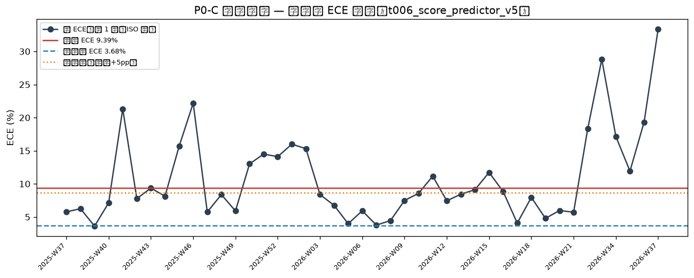
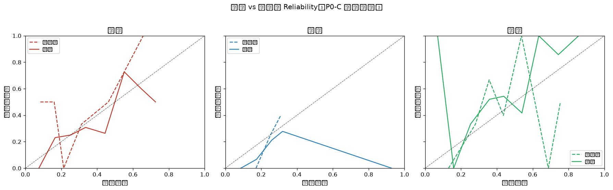

# 概念漂移检测报告（P0-C Concept Drift Gate）

**生成时间**: 2026-09-15 10:26:16
**模型**: `t006_score_predictor_v5`
**窗口模式**: `size-120`（近窗 n=120，参考窗 n=120）
**近窗日期区间**: 2026-05-24 ~ 2026-09-07
**参考窗日期区间**: 2026-05-09 ~ 2026-05-24

## 一、两窗口对比总览

| 窗口 | n | 日期区间 | 总 ECE | LogLoss | Brier | 联赛 Top3 |
|---|---|---|---|---|---|---|
| 近窗 | 120 | 2026-05-24~2026-09-07 | 9.39% (客7.13/平6.18/主14.86) | 0.9898 | 0.5868 | [('西甲', 42), ('意甲', 33), ('法甲', 17)] |
| 参考窗 | 120 | 2026-05-09~2026-05-24 | 3.68% (客3.82/平0.97/主6.24) | 1.0839 | 0.6550 | [('西甲', 36), ('英超', 25), ('意甲', 23)] |

## 二、核心指标

| 指标 | 近窗 | 参考窗 | 判定 |
|---|---|---|---|
| ΔECE（总 ECE 差值） | 9.39% | 3.68% | +5.71pp（阈值 5.00pp）|
| LogLoss 劣化比 | 0.9898 | 1.0839 | 0.91x（阈值 1.30x）|
| Brier 劣化比 | 0.5868 | 0.6550 | 0.90x（阈值 1.30x）|
| PSI（预测概率分布） | — | — | 0.946（观察 0.10 / 强化 0.25）|
| 基础率 P(y) TV | — | — | 0.150（阈值 0.20，仅上下文）|

## 三、检测结果：FAIL

**违规项（检测到概念漂移，需人工复核）**:

1. ΔECE +5.71pp（近窗 9.39% vs 参考 3.68%）≥ 阈值 5.00pp → P(Y|X) 条件校准漂移

**观察项（软信号，不告警）**:

- PSI 0.946 ≥ 0.25：预测概率输入分布显著漂移（佐证强化）

## 四、分桶明细（近窗每类每桶 conf/acc/gap，红标 = 触发局部漂移）

| 类别 | 桶 | n | 近窗预测均值 | 近窗命中率 | 近窗偏差 | 参考窗偏差 |
|---|---|---|---|---|---|---|
| 客胜 | 0.0-0.1 | 7 | 7.48% | 0.00% | +7.48pp | -41.66pp |
| 客胜 | 0.1-0.2 | 13 | 16.56% | 23.08% | -6.52pp | -33.98pp |
| 客胜 | 0.2-0.3 | 24 | 25.18% | 25.00% | +0.18pp | +21.34pp |
| 客胜 | 0.3-0.4 | 39 | 33.56% | 30.77% | +2.79pp | -2.01pp |
| 客胜 | 0.4-0.5 | 19 | 44.42% | 26.32% | +18.10pp | -3.72pp |
| 客胜 | 0.5-0.6 | 11 | 55.14% | 72.73% | -17.59pp | -34.27pp |
| 平局 | 0.0-0.1 | 1 | 8.64% | 0.00% | +8.64pp | +17.13pp |
| 平局 | 0.1-0.2 | 15 | 17.40% | 6.67% | +10.73pp | +0.18pp |
| 平局 | 0.2-0.3 | 85 | 25.94% | 21.18% | +4.76pp | -9.00pp |
| 主胜 | 0.0-0.1 | 2 | 6.93% | 100.00% | -93.07pp | +13.06pp |
| 主胜 | 0.1-0.2 | 14 | 15.89% | 0.00% | +15.89pp | -5.24pp |
| 主胜 | 0.2-0.3 | 18 | 25.34% | 33.33% | -8.00pp | -30.94pp |
| 主胜 | 0.3-0.4 | 25 | 35.86% | 52.00% | -16.14pp | +3.85pp |
| 主胜 | 0.4-0.5 | 35 | 43.86% | 54.29% | -10.43pp | -46.26pp |
| 主胜 | 0.5-0.6 | 12 | 54.00% | 41.67% | +12.34pp | +68.76pp |
| 主胜 | 0.6-0.7 | 6 | 63.40% | 100.00% | -36.60pp | +25.47pp |

## 五、滚动趋势（近 1 年周 ECE）

| 周 | n | ECE | ECE_draw | LogLoss |
|---|---|---|---|---|
| 2025-W37 | 40 | 5.77% | 5.41% | 1.0246 |
| 2025-W38 | 49 | 6.25% | 5.51% | 1.0811 |
| 2025-W39 | 54 | 3.62% | 3.59% | 1.0745 |
| 2025-W40 | 51 | 7.13% | 3.48% | 1.0304 |
| 2025-W41 | 7 | 21.31% | 31.97% | 1.2395 |
| 2025-W42 | 40 | 7.77% | 9.27% | 1.0903 |
| 2025-W43 | 45 | 9.36% | 5.51% | 1.0286 |
| 2025-W44 | 63 | 8.13% | 3.53% | 1.0768 |
| 2025-W45 | 51 | 15.66% | 10.55% | 1.0706 |
| 2025-W46 | 12 | 22.17% | 17.50% | 0.9825 |
| 2025-W47 | 34 | 5.75% | 4.14% | 1.0687 |
| 2025-W48 | 49 | 8.38% | 9.10% | 1.0148 |
| 2025-W49 | 59 | 5.91% | 3.15% | 1.0564 |
| 2025-W50 | 48 | 13.01% | 17.65% | 0.9652 |
| 2025-W51 | 40 | 14.49% | 16.99% | 1.1396 |
| 2025-W52 | 24 | 14.10% | 16.89% | 1.0047 |
| 2026-W01 | 43 | 15.99% | 14.16% | 1.1419 |
| 2026-W02 | 49 | 15.31% | 19.74% | 1.0937 |
| 2026-W03 | 53 | 8.38% | 3.80% | 1.0296 |
| 2026-W04 | 48 | 6.75% | 7.02% | 1.0502 |
| 2026-W05 | 49 | 3.98% | 4.60% | 1.0575 |
| 2026-W06 | 47 | 5.93% | 4.78% | 1.0894 |
| 2026-W07 | 51 | 3.77% | 1.46% | 1.0486 |
| 2026-W08 | 46 | 4.45% | 5.26% | 1.1062 |
| 2026-W09 | 49 | 7.49% | 9.77% | 1.0316 |
| 2026-W10 | 53 | 8.57% | 2.18% | 1.0798 |
| 2026-W11 | 45 | 11.16% | 11.18% | 1.0623 |
| 2026-W12 | 49 | 7.44% | 7.64% | 1.0463 |
| 2026-W13 | 10 | 8.44% | 4.96% | 1.0827 |
| 2026-W14 | 28 | 9.12% | 9.85% | 1.1109 |
| 2026-W15 | 47 | 11.73% | 2.71% | 0.9924 |
| 2026-W16 | 41 | 8.83% | 3.96% | 1.0964 |
| 2026-W17 | 56 | 4.07% | 5.47% | 1.0511 |
| 2026-W18 | 45 | 7.95% | 7.92% | 1.1124 |
| 2026-W19 | 44 | 4.78% | 2.72% | 1.0500 |
| 2026-W20 | 50 | 5.98% | 2.93% | 1.0931 |
| 2026-W21 | 50 | 5.71% | 2.82% | 1.0727 |
| 2026-W22 | 7 | 18.29% | 10.71% | 1.0497 |
| 2026-W33 | 5 | 28.81% | 18.59% | 0.9869 |
| 2026-W34 | 30 | 17.14% | 14.29% | 1.0206 |
| 2026-W35 | 45 | 11.92% | 8.78% | 0.9294 |
| 2026-W36 | 23 | 19.29% | 9.45% | 1.0228 |
| 2026-W37 | 6 | 33.37% | 48.66% | 1.2023 |

## 六、结论

**结论**: 检测到 P(Y|X) 概念漂移，**需人工复核**（检查伤病/战术/市场环境变化、数据源质量等）；本报告**不触发任何自动重训**（P0-C 红线：仅告警）。