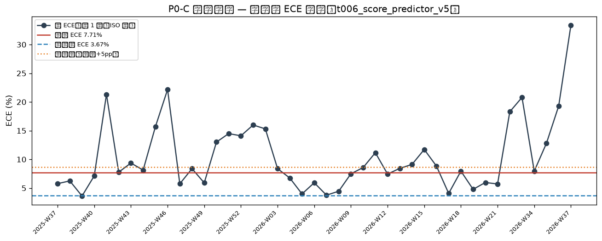
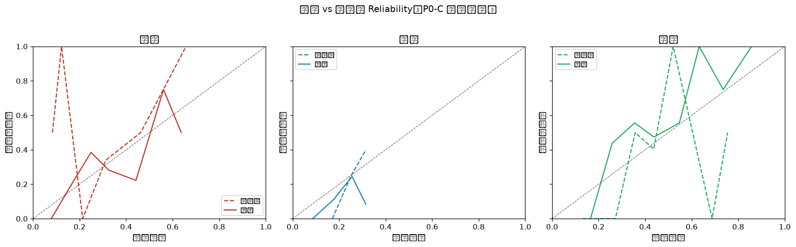

# 概念漂移检测报告（P0-C Concept Drift Gate）

**生成时间**: 2026-09-26 08:31:02
**模型**: `t006_score_predictor_v5`
**窗口模式**: `size-120`（近窗 n=120，参考窗 n=120）
**近窗日期区间**: 2026-05-24 ~ 2026-09-07
**参考窗日期区间**: 2026-05-05 ~ 2026-05-24

## 一、两窗口对比总览

| 窗口 | n | 日期区间 | 总 ECE | LogLoss | Brier | 联赛 Top3 |
|---|---|---|---|---|---|---|
| 近窗 | 120 | 2026-05-24~2026-09-07 | 7.71% (客9.33/平3.74/主10.07) | 1.0124 | 0.6069 | [('西甲', 40), ('意甲', 33), ('英超', 25)] |
| 参考窗 | 120 | 2026-05-05~2026-05-24 | 3.67% (客4.63/平0.95/主5.43) | 1.0857 | 0.6563 | [('西甲', 34), ('英超', 26), ('意甲', 22)] |

## 二、核心指标

| 指标 | 近窗 | 参考窗 | 判定 |
|---|---|---|---|
| ΔECE（总 ECE 差值） | 7.71% | 3.67% | +4.04pp（阈值 5.00pp）|
| LogLoss 劣化比 | 1.0124 | 1.0857 | 0.93x（阈值 1.30x）|
| Brier 劣化比 | 0.6069 | 0.6563 | 0.92x（阈值 1.30x）|
| PSI（预测概率分布） | — | — | 0.491（观察 0.10 / 强化 0.25）|
| 基础率 P(y) TV | — | — | 0.150（阈值 0.20，仅上下文）|

## 三、检测结果：FAIL

**违规项（检测到概念漂移，需人工复核）**:

1. [客胜] 桶[0.4-0.5] 近窗 预测 44.2% vs 命中 22.2% 偏差 +22.0pp ≥ 20pp（n=18），参考窗同桶偏差 -3.7pp（正常 ≤ 10pp）→ 局部漂移

**观察项（软信号，不告警）**:

- PSI 0.491 ≥ 0.25：预测概率输入分布显著漂移（佐证强化）

## 四、分桶明细（近窗每类每桶 conf/acc/gap，红标 = 触发局部漂移）

| 类别 | 桶 | n | 近窗预测均值 | 近窗命中率 | 近窗偏差 | 参考窗偏差 |
|---|---|---|---|---|---|---|
| 客胜 | 0.0-0.1 | 3 | 7.84% | 0.00% | +7.84pp | -41.66pp |
| 客胜 | 0.1-0.2 | 10 | 16.58% | 20.00% | -3.42pp | -87.77pp |
| 客胜 | 0.2-0.3 | 13 | 24.90% | 38.46% | -13.56pp | +21.34pp |
| 客胜 | 0.3-0.4 | 64 | 32.56% | 28.12% | +4.43pp | -2.68pp |
| 客胜 | 0.4-0.5 | 18 | 44.23% | 22.22% | +22.01pp | -3.72pp 🔴 |
| 客胜 | 0.5-0.6 | 8 | 56.06% | 75.00% | -18.94pp | -34.27pp |
| 平局 | 0.0-0.1 | 1 | 8.64% | 0.00% | +8.64pp | +17.13pp |
| 平局 | 0.1-0.2 | 9 | 17.64% | 11.11% | +6.53pp | +0.18pp |
| 平局 | 0.2-0.3 | 98 | 25.55% | 24.49% | +1.06pp | -8.49pp |
| 主胜 | 0.1-0.2 | 11 | 16.50% | 0.00% | +16.50pp | +13.06pp |
| 主胜 | 0.2-0.3 | 16 | 25.81% | 43.75% | -17.94pp | +27.19pp |
| 主胜 | 0.3-0.4 | 18 | 35.48% | 55.56% | -20.07pp | -14.27pp |
| 主胜 | 0.4-0.5 | 57 | 43.80% | 47.37% | -3.57pp | +3.29pp |
| 主胜 | 0.5-0.6 | 9 | 54.69% | 55.56% | -0.87pp | -47.95pp |
| 主胜 | 0.6-0.7 | 4 | 63.22% | 100.00% | -36.78pp | +68.76pp |
| 主胜 | 0.7-0.8 | 4 | 73.54% | 75.00% | -1.46pp | +25.47pp |

## 五、滚动趋势（近 1 年周 ECE）

| 周 | n | ECE | ECE_draw | LogLoss |
|---|---|---|---|---|
| 2025-W37 | 40 | 5.77% | 5.41% | 1.0246 |
| 2025-W38 | 49 | 6.25% | 5.51% | 1.0811 |
| 2025-W39 | 54 | 3.62% | 3.59% | 1.0745 |
| 2025-W40 | 51 | 7.13% | 3.48% | 1.0304 |
| 2025-W41 | 7 | 21.31% | 31.97% | 1.2395 |
| 2025-W42 | 40 | 7.77% | 9.27% | 1.0903 |
| 2025-W43 | 45 | 9.36% | 5.51% | 1.0286 |
| 2025-W44 | 63 | 8.13% | 3.53% | 1.0768 |
| 2025-W45 | 51 | 15.66% | 10.55% | 1.0706 |
| 2025-W46 | 12 | 22.17% | 17.50% | 0.9825 |
| 2025-W47 | 34 | 5.75% | 4.14% | 1.0687 |
| 2025-W48 | 49 | 8.38% | 9.10% | 1.0148 |
| 2025-W49 | 59 | 5.91% | 3.15% | 1.0564 |
| 2025-W50 | 48 | 13.01% | 17.65% | 0.9652 |
| 2025-W51 | 40 | 14.49% | 16.99% | 1.1396 |
| 2025-W52 | 24 | 14.10% | 16.89% | 1.0047 |
| 2026-W01 | 43 | 15.99% | 14.16% | 1.1419 |
| 2026-W02 | 49 | 15.31% | 19.74% | 1.0937 |
| 2026-W03 | 53 | 8.38% | 3.80% | 1.0296 |
| 2026-W04 | 48 | 6.75% | 7.02% | 1.0502 |
| 2026-W05 | 49 | 3.98% | 4.60% | 1.0575 |
| 2026-W06 | 47 | 5.93% | 4.78% | 1.0894 |
| 2026-W07 | 51 | 3.77% | 1.46% | 1.0486 |
| 2026-W08 | 46 | 4.45% | 5.26% | 1.1062 |
| 2026-W09 | 49 | 7.49% | 9.77% | 1.0316 |
| 2026-W10 | 53 | 8.57% | 2.18% | 1.0798 |
| 2026-W11 | 45 | 11.16% | 11.18% | 1.0623 |
| 2026-W12 | 49 | 7.44% | 7.64% | 1.0463 |
| 2026-W13 | 10 | 8.44% | 4.96% | 1.0827 |
| 2026-W14 | 28 | 9.12% | 9.85% | 1.1109 |
| 2026-W15 | 47 | 11.73% | 2.71% | 0.9924 |
| 2026-W16 | 41 | 8.83% | 3.96% | 1.0964 |
| 2026-W17 | 56 | 4.07% | 5.47% | 1.0511 |
| 2026-W18 | 45 | 7.95% | 7.92% | 1.1124 |
| 2026-W19 | 44 | 4.78% | 2.72% | 1.0500 |
| 2026-W20 | 50 | 5.98% | 2.93% | 1.0931 |
| 2026-W21 | 50 | 5.71% | 2.82% | 1.0727 |
| 2026-W22 | 7 | 18.29% | 10.71% | 1.0497 |
| 2026-W33 | 3 | 20.80% | 8.16% | 1.0127 |
| 2026-W34 | 26 | 7.95% | 5.56% | 1.0267 |
| 2026-W35 | 41 | 12.81% | 9.92% | 0.9738 |
| 2026-W36 | 23 | 19.29% | 9.45% | 1.0228 |
| 2026-W37 | 6 | 33.37% | 48.66% | 1.2023 |

## 六、结论

**结论**: 检测到 P(Y|X) 概念漂移，**需人工复核**（检查伤病/战术/市场环境变化、数据源质量等）；本报告**不触发任何自动重训**（P0-C 红线：仅告警）。