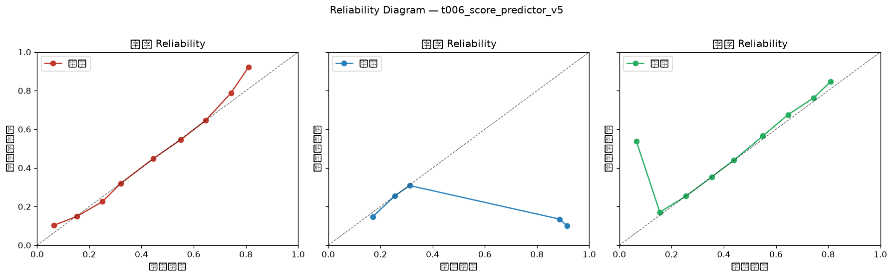

# 可靠性图门禁报告（P0-B Reliability Gate）

**生成时间**: 2026-09-10 09:16:33
**模型**: `t006_score_predictor_v5`
**样本量**: 14392 场（已完赛 + 有 Score_grid 预测）
**门禁状态**: ❌ FAIL 阻断投产

## 一、总览

| 指标 | 值 | 阈值 | 判定 |
|---|---|---|---|
| 总 ECE（每类均值） | 2.07% | 10.00% | PASS |
| ECE_draw（平局） | 2.65% | 8.00% | PASS |
| 分桶最大偏差（|预测-命中|） | 81.4pp | 15pp | FAIL |
| 平局命中率 | 24.78% | — | — |
| 平局预测均值 | 27.40% | — | 预测均值 vs 命中率反映高估/低估 |

## 二、违规项（阻断投产）

1. 可靠性图[平局] 桶[0.8-0.9] 预测 88.6% vs 命中 13.5% 偏差 +75.1pp ≥ 15pp（n=274）
1. 可靠性图[平局] 桶[0.9-1.0] 预测 91.4% vs 命中 10.1% 偏差 +81.4pp ≥ 15pp（n=169）
1. 可靠性图[主胜] 桶[0.0-0.1] 预测 6.5% vs 命中 53.8% 偏差 -47.3pp ≥ 15pp（n=637）

## 三、分联赛

| 分层 | n | 总ECE | ECE客 | ECE平 | ECE主 | 状态 |
|---|---|---|---|---|---|---|
| 德甲 | 2440 | 3.65% | 3.06% | 2.99% | 4.89% | PASS |
| 意甲 | 2994 | 3.13% | 1.78% | 3.74% | 3.87% | PASS |
| 法甲 | 2725 | 2.83% | 2.29% | 3.22% | 2.98% | PASS |
| 英超 | 3177 | 3.16% | 1.41% | 4.11% | 3.96% | PASS |
| 西甲 | 3000 | 3.66% | 3.17% | 3.28% | 4.53% | PASS |

## 四、赔率区间（竞彩去抽水隐含概率）

| 分层 | n | 总ECE | ECE客 | ECE平 | ECE主 | 状态 |
|---|---|---|---|---|---|---|
| <0.35 | 90 | 4.87% | 4.10% | 3.56% | 6.96% | PASS |
| 0.35-0.45 | 2916 | 0.45% | 0.32% | 0.07% | 0.95% | PASS |
| 0.45-0.55 | 2212 | 1.91% | 2.97% | 0.67% | 2.11% | PASS |
| 0.55-0.65 | 1852 | 1.01% | 1.03% | 0.50% | 1.49% | PASS |
| >=0.65 | 1839 | 1.81% | 1.20% | 2.20% | 2.02% | PASS |

## 五、场景（市场主客强弱）

| 分层 | n | 总ECE | ECE客 | ECE平 | ECE主 | 状态 |
|---|---|---|---|---|---|---|
| 主强 | 4259 | 1.19% | 1.36% | 0.55% | 1.67% | PASS |
| 客强 | 2145 | 0.95% | 0.85% | 1.10% | 0.89% | PASS |
| 均势 | 2505 | 0.57% | 0.55% | 0.36% | 0.81% | PASS |

## 六、Reliability Diagram（10 分桶，预测均值 vs 命中率）

| 类别 | 桶 | n | 预测均值 | 命中率 | 偏差 |
|---|---|---|---|---|---|
| 客胜 | 0.0-0.1 | 944 | 6.43% | 10.28% | -3.84pp |
| 客胜 | 0.1-0.2 | 1968 | 15.27% | 14.94% | +0.33pp |
| 客胜 | 0.2-0.3 | 2133 | 25.01% | 22.55% | +2.46pp |
| 客胜 | 0.3-0.4 | 6800 | 32.07% | 32.03% | +0.05pp |
| 客胜 | 0.4-0.5 | 1015 | 44.47% | 44.83% | -0.36pp |
| 客胜 | 0.5-0.6 | 731 | 55.04% | 54.58% | +0.46pp |
| 客胜 | 0.6-0.7 | 529 | 64.61% | 64.65% | -0.04pp |
| 客胜 | 0.7-0.8 | 259 | 74.26% | 78.76% | -4.50pp |
| 客胜 | 0.8-0.9 | 13 | 81.06% | 92.31% | -11.25pp |
| 平局 | 0.1-0.2 | 1278 | 17.09% | 14.79% | +2.30pp |
| 平局 | 0.2-0.3 | 11145 | 25.58% | 25.60% | -0.02pp |
| 平局 | 0.3-0.4 | 1526 | 31.24% | 30.87% | +0.37pp |
| 平局 | 0.8-0.9 | 274 | 88.63% | 13.50% | +75.12pp |
| 平局 | 0.9-1.0 | 169 | 91.42% | 10.06% | +81.36pp |
| 主胜 | 0.0-0.1 | 637 | 6.50% | 53.85% | -47.35pp |
| 主胜 | 0.1-0.2 | 982 | 15.49% | 17.11% | -1.62pp |
| 主胜 | 0.2-0.3 | 1257 | 25.51% | 25.38% | +0.14pp |
| 主胜 | 0.3-0.4 | 1805 | 35.34% | 35.29% | +0.05pp |
| 主胜 | 0.4-0.5 | 6713 | 43.89% | 44.03% | -0.15pp |
| 主胜 | 0.5-0.6 | 1337 | 54.98% | 56.54% | -1.57pp |
| 主胜 | 0.6-0.7 | 998 | 64.60% | 67.54% | -2.94pp |
| 主胜 | 0.7-0.8 | 617 | 74.47% | 76.34% | -1.86pp |
| 主胜 | 0.8-0.9 | 46 | 81.01% | 84.78% | -3.78pp |

## 七、结论

**结论**: 概率可靠性未达标（存在平局高估/校准偏差），**阻断投产**；需校准修正或回退模型后重跑本门禁，PASS 方可晋升。