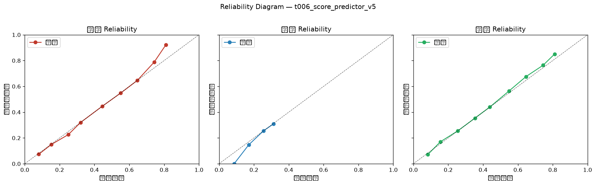

# 可靠性图门禁报告（P0-B Reliability Gate）

**生成时间**: 2026-09-24 10:51:53
**模型**: `t006_score_predictor_v5`
**样本量**: 13999 场（已完赛 + 有 Score_grid 预测）
**门禁状态**: ✅ PASS 可投产

## 一、总览

| 指标 | 值 | 阈值 | 判定 |
|---|---|---|---|
| 总 ECE（每类均值） | 0.49% | 10.00% | PASS |
| ECE_draw（平局） | 0.26% | 8.00% | PASS |
| 分桶最大偏差（|预测-命中|） | 11.3pp | 15pp | PASS |
| 平局命中率 | 25.18% | — | — |
| 平局预测均值 | 25.42% | — | 预测均值 vs 命中率反映高估/低估 |

## 三、分联赛

| 分层 | n | 总ECE | ECE客 | ECE平 | ECE主 | 状态 |
|---|---|---|---|---|---|---|
| 德甲 | 2360 | 2.17% | 2.88% | 0.70% | 2.93% | PASS |
| 意甲 | 2947 | 1.88% | 1.60% | 1.72% | 2.31% | PASS |
| 法甲 | 2670 | 1.62% | 2.28% | 1.21% | 1.38% | PASS |
| 英超 | 3087 | 1.30% | 0.98% | 1.32% | 1.59% | PASS |
| 西甲 | 2935 | 2.01% | 3.08% | 0.89% | 2.07% | PASS |

## 四、赔率区间（竞彩去抽水隐含概率）

| 分层 | n | 总ECE | ECE客 | ECE平 | ECE主 | 状态 |
|---|---|---|---|---|---|---|
| <0.35 | 65 | 5.18% | 4.56% | 3.21% | 7.77% | PASS |
| 0.35-0.45 | 2111 | 0.92% | 0.40% | 0.84% | 1.52% | PASS |
| 0.45-0.55 | 1623 | 1.50% | 1.87% | 0.43% | 2.20% | PASS |
| 0.55-0.65 | 1281 | 1.46% | 2.32% | 0.43% | 1.63% | PASS |
| >=0.65 | 1223 | 2.55% | 0.91% | 3.76% | 2.97% | PASS |

## 五、场景（市场主客强弱）

| 分层 | n | 总ECE | ECE客 | ECE平 | ECE主 | 状态 |
|---|---|---|---|---|---|---|
| 主强 | 3054 | 1.71% | 1.14% | 1.59% | 2.40% | PASS |
| 客强 | 1437 | 0.80% | 1.25% | 0.90% | 0.24% | PASS |
| 均势 | 1812 | 0.85% | 0.69% | 0.26% | 1.60% | PASS |

## 六、Reliability Diagram（10 分桶，预测均值 vs 命中率）

| 类别 | 桶 | n | 预测均值 | 命中率 | 偏差 |
|---|---|---|---|---|---|
| 客胜 | 0.0-0.1 | 503 | 8.03% | 7.36% | +0.68pp |
| 客胜 | 0.1-0.2 | 1968 | 15.27% | 14.94% | +0.33pp |
| 客胜 | 0.2-0.3 | 2132 | 25.01% | 22.61% | +2.40pp |
| 客胜 | 0.3-0.4 | 6838 | 32.08% | 32.06% | +0.02pp |
| 客胜 | 0.4-0.5 | 1023 | 44.47% | 44.57% | -0.11pp |
| 客胜 | 0.5-0.6 | 732 | 55.06% | 54.78% | +0.28pp |
| 客胜 | 0.6-0.7 | 531 | 64.60% | 64.60% | +0.00pp |
| 客胜 | 0.7-0.8 | 259 | 74.26% | 78.76% | -4.50pp |
| 客胜 | 0.8-0.9 | 13 | 81.06% | 92.31% | -11.25pp |
| 平局 | 0.0-0.1 | 1 | 8.64% | 0.00% | +8.64pp |
| 平局 | 0.1-0.2 | 1280 | 17.09% | 14.77% | +2.32pp |
| 平局 | 0.2-0.3 | 11190 | 25.58% | 25.59% | -0.02pp |
| 平局 | 0.3-0.4 | 1528 | 31.24% | 30.89% | +0.35pp |
| 主胜 | 0.0-0.1 | 194 | 8.34% | 7.22% | +1.12pp |
| 主胜 | 0.1-0.2 | 986 | 15.49% | 17.04% | -1.55pp |
| 主胜 | 0.2-0.3 | 1262 | 25.52% | 25.52% | +0.00pp |
| 主胜 | 0.3-0.4 | 1817 | 35.34% | 35.39% | -0.05pp |
| 主胜 | 0.4-0.5 | 6739 | 43.89% | 43.98% | -0.10pp |
| 主胜 | 0.5-0.6 | 1338 | 54.98% | 56.50% | -1.52pp |
| 主胜 | 0.6-0.7 | 998 | 64.60% | 67.54% | -2.94pp |
| 主胜 | 0.7-0.8 | 618 | 74.47% | 76.38% | -1.90pp |
| 主胜 | 0.8-0.9 | 47 | 81.11% | 85.11% | -4.00pp |

## 七、结论

**结论**: 概率可靠性达标，可通过门禁投产。