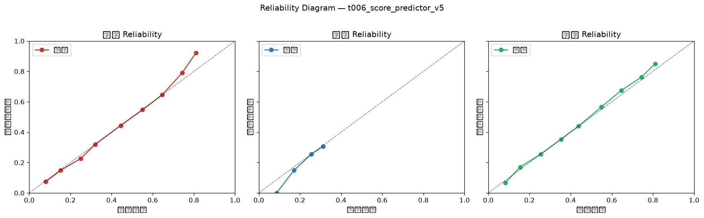

# 可靠性图门禁报告（P0-B Reliability Gate）

**生成时间**: 2026-09-26 09:00:31
**模型**: `t006_score_predictor_v5`
**样本量**: 13951 场（已完赛 + 有 Score_grid 预测）
**门禁状态**: ✅ PASS 可投产

## 一、总览

| 指标 | 值 | 阈值 | 判定 |
|---|---|---|---|
| 总 ECE（每类均值） | 0.52% | 10.00% | PASS |
| ECE_draw（平局） | 0.29% | 8.00% | PASS |
| 分桶最大偏差（|预测-命中|） | 11.3pp | 15pp | PASS |
| 平局命中率 | 25.17% | — | — |
| 平局预测均值 | 25.41% | — | 预测均值 vs 命中率反映高估/低估 |

## 三、分联赛

| 分层 | n | 总ECE | ECE客 | ECE平 | ECE主 | 状态 |
|---|---|---|---|---|---|---|
| 德甲 | 2350 | 2.20% | 2.98% | 0.69% | 2.93% | PASS |
| 意甲 | 2946 | 1.88% | 1.63% | 1.73% | 2.29% | PASS |
| 法甲 | 2656 | 1.67% | 2.26% | 1.26% | 1.49% | PASS |
| 英超 | 3079 | 1.27% | 0.94% | 1.29% | 1.57% | PASS |
| 西甲 | 2920 | 2.02% | 3.11% | 0.81% | 2.15% | PASS |

## 四、赔率区间（竞彩去抽水隐含概率）

| 分层 | n | 总ECE | ECE客 | ECE平 | ECE主 | 状态 |
|---|---|---|---|---|---|---|
| <0.35 | 65 | 5.18% | 4.56% | 3.21% | 7.77% | PASS |
| 0.35-0.45 | 2086 | 0.91% | 0.46% | 0.70% | 1.58% | PASS |
| 0.45-0.55 | 1606 | 1.53% | 1.84% | 0.46% | 2.29% | PASS |
| 0.55-0.65 | 1272 | 1.50% | 2.37% | 0.49% | 1.65% | PASS |
| >=0.65 | 1211 | 2.41% | 0.95% | 3.60% | 2.69% | PASS |

## 五、场景（市场主客强弱）

| 分层 | n | 总ECE | ECE客 | ECE平 | ECE主 | 状态 |
|---|---|---|---|---|---|---|
| 主强 | 3024 | 1.74% | 1.19% | 1.53% | 2.49% | PASS |
| 客强 | 1422 | 0.85% | 1.39% | 0.87% | 0.28% | PASS |
| 均势 | 1794 | 0.81% | 0.76% | 0.14% | 1.54% | PASS |

## 六、Reliability Diagram（10 分桶，预测均值 vs 命中率）

| 类别 | 桶 | n | 预测均值 | 命中率 | 偏差 |
|---|---|---|---|---|---|
| 客胜 | 0.0-0.1 | 500 | 8.03% | 7.40% | +0.63pp |
| 客胜 | 0.1-0.2 | 1960 | 15.27% | 14.90% | +0.37pp |
| 客胜 | 0.2-0.3 | 2114 | 25.01% | 22.66% | +2.35pp |
| 客胜 | 0.3-0.4 | 6828 | 32.08% | 32.02% | +0.06pp |
| 客胜 | 0.4-0.5 | 1020 | 44.46% | 44.41% | +0.05pp |
| 客胜 | 0.5-0.6 | 729 | 55.07% | 54.73% | +0.33pp |
| 客胜 | 0.6-0.7 | 530 | 64.59% | 64.53% | +0.06pp |
| 客胜 | 0.7-0.8 | 257 | 74.28% | 78.99% | -4.71pp |
| 客胜 | 0.8-0.9 | 13 | 81.06% | 92.31% | -11.25pp |
| 平局 | 0.0-0.1 | 1 | 8.64% | 0.00% | +8.64pp |
| 平局 | 0.1-0.2 | 1274 | 17.09% | 14.84% | +2.25pp |
| 平局 | 0.2-0.3 | 11160 | 25.57% | 25.60% | -0.03pp |
| 平局 | 0.3-0.4 | 1516 | 31.23% | 30.67% | +0.56pp |
| 主胜 | 0.0-0.1 | 193 | 8.33% | 6.74% | +1.59pp |
| 主胜 | 0.1-0.2 | 983 | 15.50% | 17.09% | -1.59pp |
| 主胜 | 0.2-0.3 | 1257 | 25.52% | 25.62% | -0.10pp |
| 主胜 | 0.3-0.4 | 1806 | 35.33% | 35.38% | -0.05pp |
| 主胜 | 0.4-0.5 | 6726 | 43.89% | 44.04% | -0.15pp |
| 主胜 | 0.5-0.6 | 1329 | 54.99% | 56.66% | -1.67pp |
| 主胜 | 0.6-0.7 | 995 | 64.60% | 67.44% | -2.84pp |
| 主胜 | 0.7-0.8 | 615 | 74.47% | 76.26% | -1.79pp |
| 主胜 | 0.8-0.9 | 47 | 81.11% | 85.11% | -4.00pp |

## 七、结论

**结论**: 概率可靠性达标，可通过门禁投产。